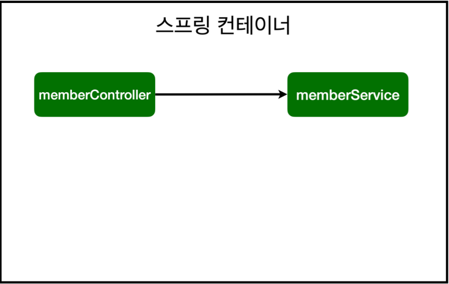
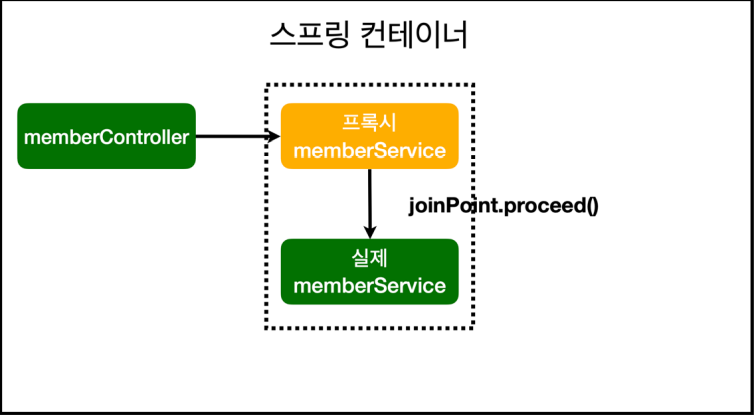
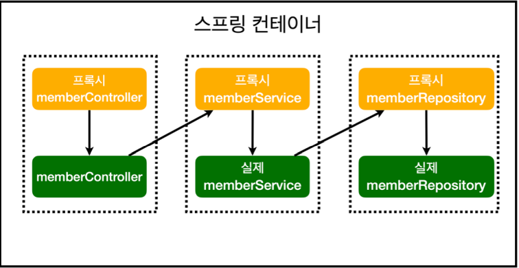

### AOP (Aspect Oriented Programming)

    package hello.First_Spring_Project.aop;

    import org.aspectj.lang.ProceedingJoinPoint;
    import org.aspectj.lang.annotation.Around;
    import org.aspectj.lang.annotation.Aspect;
    import org.springframework.stereotype.Component;

    // AOP 클래스는 좀 특별취급을 받는다. @Component를 붙여서 스캔을 할 수도 있지만
    // SpringConfig 클래스에서 수동으로 Bean 등록을 하는 것이 직관적이고 좋다고 한다.

    // @Aspect 애노테이션이 있어야 AOP로서 사용할 수 있다.
    @Aspect
    @Component
    public class TimeTraceAop {

        // "시간 측정" 이라는 공통 관심사를 어디에 쓸지 타겟팅을 해줄 수 있다.
        // execution의 경로가 다음과 같다면 First_Spring_project 패키지 하위의 것들에 모두 적용하겠다는 뜻.
        // 원리는 애플리케이션 내에서 메서드를 호출할 때마다 인터셉트가 걸려서 시간측정 로직을 수행할 수 있는 것.
        @Around("execution(* hello.First_Spring_Project..*(..))")
        public Object execute(ProceedingJoinPoint joinPoint) throws Throwable {
            // joinPoint.proceed 하면 다음 메서드로 진행이 된다고 한다.
            long start = System.currentTimeMillis();
            System.out.println("START: " + joinPoint.toString());
            try {
                return joinPoint.proceed();
            } finally {
                long finish = System.currentTimeMillis();
                long timeMs = finish - start;
                System.out.println("END: " + joinPoint.toString() + " " + timeMs + "ms");
                // 위 출력문의 결과는 다음과 같다.
                // END: execution(String hello.First_Spring_Project.controller.MemberController.list(Model)) 176ms
            }
        }
    }

##### AOP란 *공통 관심사*를 따로 뗴어서 공통적으로 적용할 수 있게끔 해주는 것이라 이해했다.

처음에는 AOP가 시간측정을 위한 기능인 줄 알았는데, 시간측정은 하나의 예시인 듯 하다.

##### AOP를 사용하면
+ 핵심 관심 대상의 코드를 간결하게 유지할 수 있다.
    + 시간 측정을 예로 들면, 위의 TimeTraceAop 코드가 핵심 관심 사항의 코드에도  
    그대로 쓰여야함. 이는 유지 보수도 어렵게 만들고, 코드도 굉장히 길어지게 만든다.
      
+ 변경이 필요할 경우 AOP 클래스의 로직만 변경하면 된다.
+ 적용 범위를 간편하게 선택할 수 있다.
***
### 동작원리

AOP를 적용하기 전에는, helloController와 memberService는 중간에  
거치는 것 없이 바로 연결된다.

AOP를 적용하면, 가짜(프록시) 빈을 먼저 앞에 세워두고, 이 가짜 빈을 먼저 실행시키고,  
가짜 빈이 끝나면 joinPoint.proceed()를 통해 진짜 빈을 실행시킨다.

위에서 살펴본 예제 코드도 finally로 시간 측정을 먼저 실행한 다음 joinPoint.proceed()를  
실행시킴으로서 실제 빈으로 진행시키고, 동시에 return으로 코드를 종료시킨다.

전체 프로젝트 구조에서는 다음과 같은 구조가 나타난다.